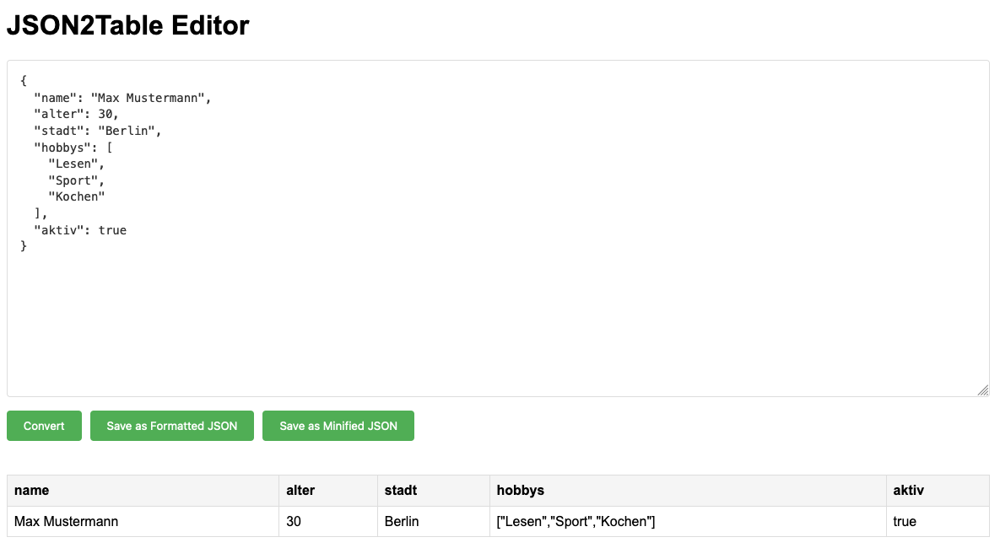

# JSON2Table

Convert JSON data to an editable table format, make your changes, and convert it back to JSON. A simple way to edit JSON data using a convenient table view.

## Demo

Try it out at [json2table.de](https://json2table.de)



## Features

- Support for various JSON formats (simple objects, arrays, nested structures)
- Conversion of JSON into clear, editable tables
- Direct editing of all values in table cells
- Automatic data type detection during conversion back to JSON
- Save as formatted JSON (readable with indentation)
- Save as minified JSON (space-saving)
- Preservation of original JSON structure
- Offline functionality - no server connection required
- **Drag-and-Drop support** - easily upload JSON files by dropping them into the editor
- **Pagination** - navigate large JSON arrays with paginated tables (50 entries per page)
- **Filter functionality** - quickly find specific data by filtering table content
- **CSV Export** - export your table data to a CSV file for use in spreadsheets
- **Dark Mode** - toggle between light and dark themes for comfortable viewing

## Usage

You can either:
- Use the online version at [json2table.de](https://json2table.de)
- Or run it locally:
  1. Clone the repository:
     ```bash
     git clone https://github.com/thisdev/JSON2Table.git
     ```
  2. Open `index.html` in your web browser

No installation or setup required! Simply drag and drop a JSON file or paste your JSON data to get started.

## Example

Input this JSON to test the functionality:
```json
{
  "name": "Max Mustermann",
  "alter": 30,
  "stadt": "Berlin",
  "hobbys": ["Lesen", "Sport", "Kochen"],
  "aktiv": true
}
```

Try filtering by "Berlin", exporting to CSV, or switching to Dark Mode to explore the new features!

## Contributing

Contributions are welcome! Feel free to:
- Submit suggestions via issues
- Create pull requests for improvements
- Share feedback

## License

This project is licensed under the MIT License - see the [LICENSE](LICENSE) file for details.

---